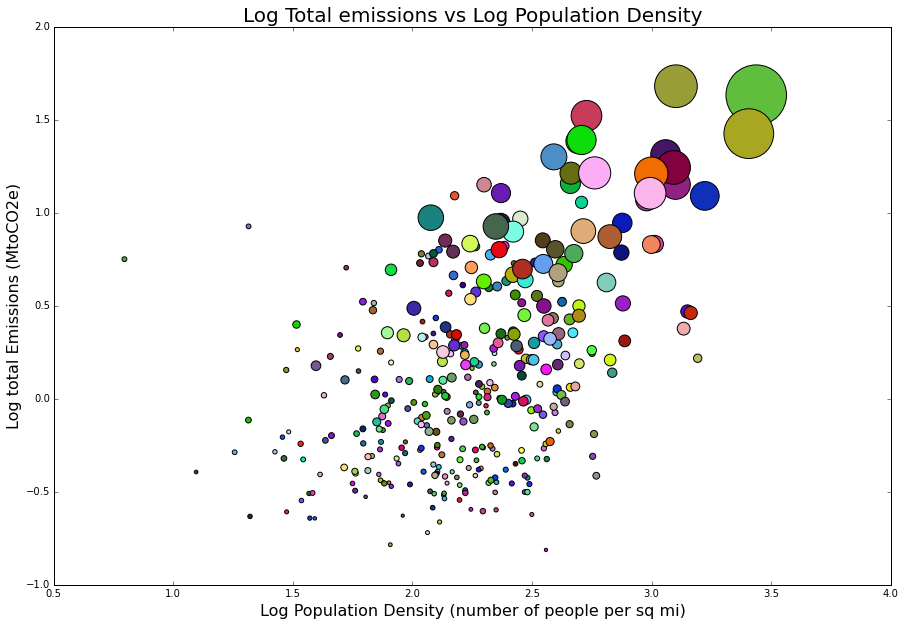

Clarity: The graphic is in fact easy to read an has clarity in terms of the information it wants to present.
Esthetic: The difference in sizes of each observation in great to make a point about the value of it, but
I don't see the value of different colors for every point, since the difference is already covered by the size of it.
Honesty: The information is in no way deformed, and in my opinion is presented as needed; I would only 
unify the colors for each of the points since it is understood that they represent different observations, and
I find the colors a little bit distracting. 